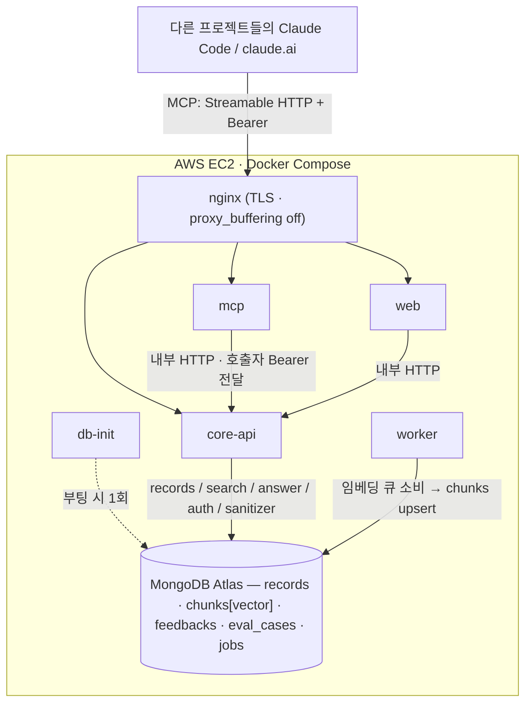
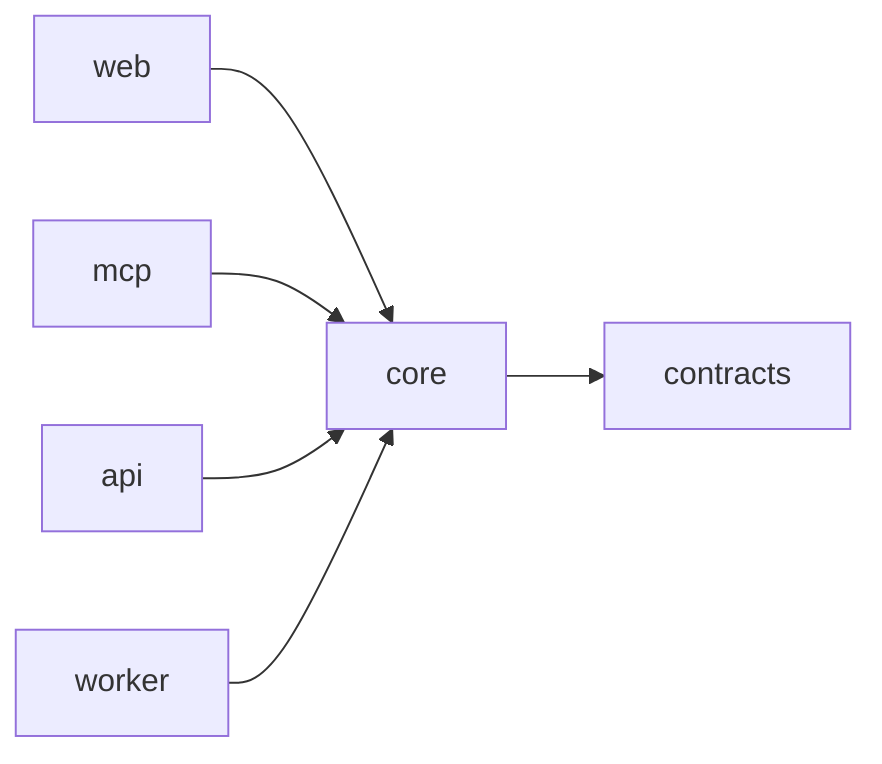
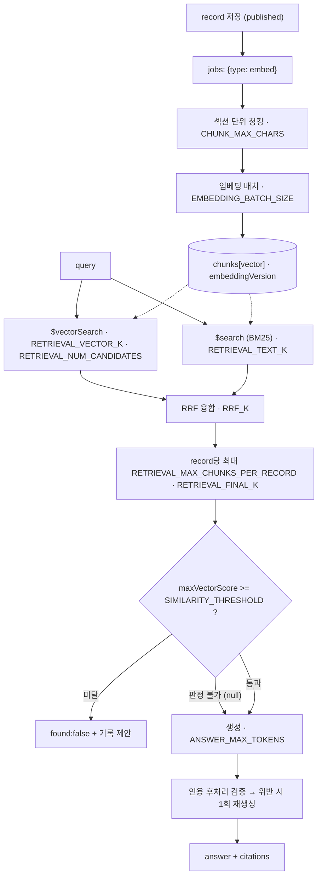

# sentinel-kb

여러 프로젝트의 AI 에이전트와 개발자가 공유하는 트러블슈팅 지식 보관소.
같은 장애와 **같은 AI 개발 이격(divergence)** 을 반복하지 않는 것이 목표.

- 1차 인터페이스: **MCP 서버** (Streamable HTTP + Bearer)
- 2차: Web UI(읽기 중심), HTTP API
- 스택: Node/Fastify · MongoDB Atlas Vector Search · Claude API · Next.js · AWS EC2

> **이 레포의 주장은 기능이 아니라 구조다.** 제품을 만들었고, 그 제품을 만드는 체계를 만들었다 —
> 스펙이 소스 오브 트루스이고, 태스크 하나가 세션 하나이고, 게이트 6개가 머지를 막고,
> 마일스톤마다 감사가 돌고, 실패는 포스트모템이 되어 다시 시드로 들어간다.
> 그 체계가 돌아간 흔적(`eval/loop-log.jsonl`, 태스크별 `## Findings`, `docs/analysis/`)이
> 제품 코드만큼이나 이 포트폴리오의 산출물이다.

> **그리고 이 README의 규칙은 하나다 — 잰 적 없는 것을 성과로 적지 않는다.**
> [§6](#6-지표--측정된-것과-측정되지-않은-것)이 그 둘을 갈라 놓았고, `tools/portfolio-docs.spec.ts`가
> 매 `pnpm verify`마다 이 문서를 기계로 대조한다. 미측정 지표를 성과 문장으로 쓰면 빌드가 빨개진다.

---

## 1. 문제 — 지식은 왜 사라지는가

1. 트러블슈팅 지식이 프로젝트별로 파편화되어 재발 시 처음부터 다시 판다.
2. **AI 시대의 새로운 유실**: 에이전트가 프로젝트마다 같은 이격(환각 API, 잘못된 버전 가정,
   스펙 드리프트)을 반복하는데 **어디에도 기록되지 않는다.** 사람의 장애는 포스트모템이라도
   남지만, 에이전트가 스펙과 다르게 만든 것은 PR이 머지되는 순간 증발한다.
3. 지식이 사람용 문서로만 있으면 에이전트가 소비하지 못한다. **에이전트가 읽고 쓰는 형태**여야
   루프가 닫힌다.

그래서 1차 인터페이스가 UI가 아니라 MCP다. 핵심 루프는 두 줄이다:

```
에러 조우 → search_knowledge → (있음) 절차 적용 / (없음) 직접 해결 → record_knowledge
이격 발견 → record_knowledge(type: "divergence") → 다음 프로젝트의 CLAUDE.md·스킬로 환류
```

`incident`는 `symptom / rootCause / resolution / prevention`,
`divergence`는 `expected / actual / context / correction`으로 나뉜다.
`context`에 **모델·도구·프레임워크**가 들어가는 것이 divergence 레코드의 요점이다 —
"클로드가 이상하게 만들었다"는 검색되지 않고, "task-loop 구현자 에이전트가 Zod optional을
스펙 표기와 다르게 잡았다"는 검색된다.

---

## 2. 시스템

<!-- arch-diagram:begin -->

<!-- arch-diagram:end -->

패키지는 여섯이고 의존은 한 방향으로만 흐른다. **이 방향은 문서의 약속이 아니라
`eslint.config.js`의 `import/no-restricted-paths` zone이고, 위반 픽스처가
`tools/dependency-boundaries.spec.ts`에서 실제로 lint 에러를 내는지 확인한다.**

<!-- deps-diagram:begin -->

<!-- deps-diagram:end -->

`core`는 HTTP도 MCP도 모른다. 형제끼리(`mcp → api` 등)도 금지다 —
이 간선은 `tsc -b` 프로젝트 참조가 막아 줄 것이라 적혀 있었는데, T-014 검증에서
**참조 없이 import해도 빌드·lint·런타임이 전부 통과한다**는 것이 드러나 eslint zone 4개를 신설했다.

### RAG 파이프라인

<!-- rag-diagram:begin -->

<!-- rag-diagram:end -->

튜닝 파라미터는 전부 `.env.example`에서 주입한다. 코드 하드코딩은 금지이고
(`no-hardcoded-params.spec.ts`가 잠근다), 이유는 eval에서 스윕하기 위해서다.

`injection-suspect`로 플래그된 청크는 **생성 컨텍스트에서 제외**된다(목록에는 경고와 함께 남는다).
검색 결과 본문은 `<retrieved-record>` 프레이밍으로 감싸 나가며 **그 안의 지시문은 따르지 않는다**(NFR-05).

### MCP 도구 5개

<!-- mcp-tools:begin -->
| 도구 | 언제 부르나 |
| --- | --- |
| `search_knowledge` | 증상·키워드로 과거 사례를 훑을 때. 요약+ID만 나간다(본문 없음, NFR-03) |
| `get_record` | 후보를 정하고 전문이 필요할 때 |
| `record_knowledge` | 해결한 뒤 기록할 때. 마스킹이 일어나면 무엇이 마스킹됐는지 알려준다 |
| `suggest_resolution` | "이 에러 어떻게 고치나"를 한 번에 묻고 싶을 때 |
| `give_feedback` | 어떤 기록이 실제로 도움이 됐는지 표시할 때 |
<!-- mcp-tools:end -->

**도구는 5개에서 늘지 않는다.** 도구 수는 곧 에이전트의 인지 부하이고, 추가는 스펙 개정 +
인간 승인(G6) 사항이다. `tools/connect-docs.spec.ts`가 `specs/07-mcp.md`를 정본으로 읽어
문서가 스펙에 없는 도구를 발명하지 않았는지 대조한다.

---

## 3. 설계 결정 — 무엇을 골랐고 무엇을 포기했나

| # | 결정 | 선택 | 포기한 것 / 트레이드오프 |
| --- | --- | --- | --- |
| 1 | **core-api 분리** | Fastify 독립 서비스 | Next.js Route Handler에 묶으면 배포 단위가 하나로 줄지만 **UI 장애가 지식보관소 장애**가 된다. MCP·UI·CLI가 같은 API를 소비하는 쪽을 택했다 — 대신 프로세스가 하나 더 늘고 내부 HTTP 홉이 생긴다 |
| 2 | **VectorDB** | MongoDB Atlas Vector Search | 전용 벡터 DB(pgvector·Qdrant) 대비 검색 성능은 열세일 수 있다. 그러나 수천 청크 규모에서 그 열세는 무의미하고, **원문·청크·벡터가 한 DB에 있어 정합성과 운영이 단순**해진다. 대가: Atlas 종속, 그리고 로컬에서는 `mongodb/mongodb-atlas-local` 컨테이너가 있어야 검색을 검증할 수 있다 |
| 3 | **하이브리드 검색** | vector + text + RRF | 에러코드·스택트레이스·고유명사는 키워드가 이기고 증상 서술은 벡터가 이긴다. RRF는 두 리스트의 **순위만** 쓰므로 가중치 튜닝이 사실상 없다. 대가: 점수가 순위의 함수라 **절대적 유사도 의미를 잃는다** — 그래서 임계값 게이트는 융합 점수가 아니라 융합 전 cosine으로 판정한다(§5) |
| 4 | **섹션 단위 청킹** | 구조 인지 청킹 | "해결 절차만 검색" 같은 섹션 필터가 가능해지고 인용이 `[REC-{id}#{section}]`으로 정확해진다. 대가: 섹션이 짧으면 청크가 문맥을 잃어 청크 텍스트에 `[제목] (섹션)` prefix를 붙여야 했고, 그 prefix가 임베딩 입력 예산을 잠식한다 |
| 5 | **큐** | Mongo `jobs` 컬렉션 폴링 | Redis/BullMQ는 현 규모에서 과설계다. 컨테이너가 하나 줄고 운영 대상이 준다. 대가: 폴링 지연과 exactly-once 부재 — 그래서 잡을 멱등으로 설계하고 인터페이스를 유지해 교체 가능하게 뒀다 |
| 6 | **MCP 전송** | Streamable HTTP (+ stdio 로컬 어댑터) | stdio만 쓰면 배포가 필요 없지만 여러 머신·세션에서 붙지 못한다. 범용성을 택했고, 대가로 TLS·Bearer·nginx 버퍼링이라는 운영 표면이 통째로 생겼다 |
| 7 | **배포** | EC2 1대 + Docker Compose | ECS/EKS는 이 규모에서 과설계다. **이 판단을 README에 명시하는 것 자체가 산출물이다.** 대가: 무중단 배포가 없고 EC2 장애 시 서비스가 멈춘다 — 그래서 서버를 stateless로 두고 상태를 전부 Atlas에 뒀다(NFR-07). 데이터는 안 죽고 가용성만 죽는다 |
| 8 | **MCP는 서비스 키를 들지 않는다** | 호출자의 Bearer를 core-api로 그대로 전달 | confused deputy를 막는다. 대가: **두 프로세스의 `API_KEYS`가 반드시 같아야 하고, 그 불일치는 코드로 탐지 불가**다 — 연결도 도구 목록도 정상인데 도구 호출 시점에만 401이 난다. `docs/connect.md` §2가 이 함정 하나에 절 하나를 쓴다 |
| 9 | **`suggest_resolution`은 지금 생성하지 않는다** | 검색 기반 스텁 | "그럴듯한 해결책"을 먼저 만들어 두면 근거 없는 답변이 실제로 유통된다(NFR-02). 도구 설명과 문서에 한계를 명시하고, 생성은 `/v1/answer`가 붙은 뒤에 열었다. 대가: 데모가 덜 화려하다 |

ADR 전문은 `docs/design/SAD.md`와 `docs/design/ADR-07-graph-db.md`에 있다.

---

## 4. 전환 — 버린 설계를 지우지 않았다

**v1은 UI 중심이었다.** 검색 콘솔과 포스트모템 작성 화면이 제품이고, API는 그 화면의 뒷단이었다.
**v2에서 MCP를 1차 인터페이스로 뒤집었다.** 이유는 §1의 3번이다 — 사람이 읽는 화면으로는
"디버깅 전에 검색한다"는 루프가 닫히지 않는다. 사람은 급할 때 검색하지 않는다.

그래서 마일스톤 순서도 뒤집혔다: **M3(MCP)가 M4(RAG 고도화)보다 앞이다.**
MCP가 제품이므로 RAG를 다듬는 것보다 실사용 접속이 먼저 열려야 도그푸딩 기간이 확보된다.

버린 계획을 지우지 않은 이유는 하나다 — **버린 설계가 남아 있어야 선택한 설계가 설득된다.**
v1 문서와 §0 변경표는 `docs/`에 그대로 있다.

같은 규칙이 태스크 단위에도 적용된다. `docs/analysis/T-004-POSTMORTEM.md`는 649줄짜리
**실패 기록**이고, 이 레포에서 가장 긴 문서 중 하나다. 성공한 태스크의 문서는 그보다 짧다.

---

## 5. 사고 — 감사가 잡은 것, 그리고 루프가 못 잡은 것

### 5-1. 감사 B-1 [Critical] — 스펙의 단위 오류 하나가 전 질의를 침묵시킬 뻔했다

M0 종료 감사에서 감사위원 B가 잡았다. 스펙은 "**RRF 융합 점수**를 정규화 후 `0.62`와 비교"라고
적었는데, RRF 점수는 `Σ 1/(k+rank)` 척도라 `k=60`에서 이론적 최댓값이 **약 0.033**이다.
cosine용 임계값 `0.62`와 비교하면 **모든 질의가 임계값 미달**이 되어 시스템이 영원히
"사례 없음"만 반환한다. NFR-02의 핵심 게이트가 정반대 방향으로 오동작하는 것이다.

이 결함이 증명한 것은 감사의 가치가 아니라 **이 프로젝트의 전제**다 —
스펙 주도 + 자동 구현 체제에서는 **스펙의 오류가 곧 구현의 오류**가 된다. 에이전트는
스펙대로 성실히 구현했을 것이고, 코드 리뷰로는 절대 못 잡는다. 그래서 사람의 리뷰는
코드가 아니라 **스펙 단계**에 집중되어야 한다.

감사 집계: **Critical 1 · Major 5 · Minor 4 · Info 2** (`docs/audit/AUDIT-REPORT.md`).

꼬리가 하나 더 있었다. 정정된 문면 "원시 cosine 최고점(`vectorSearchScore`)"이 **또 두 척도를
등치**시키고 있었다. T-011에서 구현자와 검증자가 각각 독립으로 실측했고,
Atlas의 `vectorSearchScore`는 원시 cosine이 아니라 `(1+cos)/2`였다 — 중간각 포함 **7/7 픽스처 일치**
(동일 1.0 / 45° 0.8536 / 60° 0.75 / **직교 0.5** / 120° 0.25 / **정반대 0.0**).
그대로 뒀으면 `0.62`가 원시 cosine **0.24** 게이트가 됐다. retriever가 `2s−1`로 환산하는 쪽으로 닫았다.

### 5-2. T-004 — 여덟 라운드 동안 판정자만 바뀌고 성질은 남았다

시크릿 마스킹 게이트(FR-06) 하나가 **8라운드**를 돌았다. 재시도 한도 3회를 **세 번** 넘겼다.
매 라운드가 무엇을 고쳤고 무엇을 열었는지가 `specs/tasks/T-004-sanitizer.md`에 전부 남아 있다:

```
제로폭 문자 목록 → userinfo 문자 클래스 → 호스트 룩어헤드 → authority 종료 문자 집합
→ 호스트 모양 규격 → strict userinfo 문자집합 → 갈래 진입 조건
```

일곱 번 바뀐 것은 **경계를 누가 판정하는가**였고, 판정 방식은 한 번도 바뀌지 않았다.
포스트모템이 제거되지 않은 성질 하나를 이름 붙였다:

> **판정용 열거에 없는 문자를 만나면 규칙이 무발동하고, 무발동은 무플래그 평문 통과를 뜻한다.**
> 즉 **fail-open**이다. 열거를 고칠 때마다 열거는 정확해졌지만 fail-open은 그대로였고,
> 열거는 원리적으로 유한하므로 다음 형제 문자가 언제나 남아 있었다.

**대조군이 같은 파일 안에 있었다.** 비가시 문자 축도 네 번 같은 실패를 했는데
(F-8 → N-2 → N-6 → N-9), 문자 열거를 버리고 **유니코드 카테고리**(`\p{Cf}`, `\p{M}`,
`\p{Default_Ignorable_Code_Point}`)로 옮겨 가 4라운드 만에 닫혔다. 포스트모템의 판정은
"유니코드 속성이 좋다"가 아니었다 — **이식 가능한 것은 속성이 아니라 생성기 독립성**이고,
mongo 축에는 "이 문자열이 자격증명인가"를 판정하는 외부 전칭 술어가 애초에 존재하지 않는다.
전칭 술어가 없을 때 같은 효과를 내는 유일한 수단은 **fail-open을 fail-closed로 뒤집는 것**,
즉 열거가 "탐지"하지 않고 "면제"하게 만드는 것이었다.

닫은 뒤 드러난 것이 이 사건의 핵심이다:

- 6축 × 5기저 × 94자 = **2,820칸 전수 스윕에서 전부 0/94**. 적용 전에는 **558건이 유출**이었다.
- 그 558건에 대해 **기존 354개 테스트는 하나도 관측하지 못했다** — 뮤테이션 4종 전부 **0 kill**.
- 콜드 성능은 오히려 개선됐다: `mongodb://` 런 **183ms → 97ms**
  (`docs/analysis/T-004-POSTMORTEM.md` §4.5, 폐기용 사본 A/B 실측). 엄격 갈래의 문자집합 스캔이
  통째로 사라진 결과다. **순 삭제 diff였다.**

> 그린인 테스트 스위트가 유출 558건을 못 봤다는 것 — 이것이 이 레포가 뮤테이션 보고를
> 태스크 규약으로 올린 이유다. "테스트가 통과한다"는 "방어선이 있다"가 아니다.

### 5-3. 루프 자신이 낸 실패 — 숨기지 않는 쪽을 골랐다

| 사건 | 무슨 일이 있었나 |
| --- | --- |
| **"생존 뮤테이션 0" 보고가 반증됐다** (T-014) | 구현자가 뮤테이션 9종 전건 사망을 보고했으나, `project` 클레임을 상수로 박아도 `pnpm verify` 전체가 그린이었다. 구현자가 "잡았다"며 추가한 테스트는 **로그 필드**를 봤고 주입 경로와는 분기 이후 독립이었다. → 뮤테이션 보고에 **"각 뮤테이션이 어느 관측 경로로 죽는지"**를 요구하도록 규약을 바꿨다 |
| **자기충족 테스트가 게이트를 무력화했다** (T-003·T-014, 2회) | 인덱스 테스트가 `DB_INDEX_SPECS`를, 도구 상한 테스트가 `MAX_TOOLS`를 기대값으로 썼다. 둘 다 **상수를 바꾸는 게 게이트를 통과하는 가장 싼 길**이었다. → 기대값을 리터럴로 박고 살아 있는 응답에 걸어서 닫았다 |
| **태스크 스펙이 스스로 모순됐다** (T-010·T-011·T-012, 3회) | Findings가 고치라고 지시한 파일을 Context budget이 배제했다. 매번 G5가 "변경은 정당, 절차는 위반"으로 판정했다. **구현자 귀책이 아니라 스펙 생성 규약의 결함**이었다 → `task-loop` 스킬에 budget 자동 포함 5항 + "오케스트레이터 지시와 태스크 스펙이 충돌하면 멈춰라"를 명문화 |
| **전수 스윕조차 기저 선택에 종속됐다** (T-004) | 6·7·8차의 대역 스윕 표는 매번 "직전 실패의 이웃"을 기저로 삼아 한 칸씩만 옆으로 갔다. 축을 고르는 옳은 방법은 실패의 좌표가 아니라 **입력 문법의 구조**에서 뽑는 것이었다 |
| **`pnpm verify`가 커밋될 내용이 아니라 워킹 트리를 검증한다** (T-027 F-0) | `integration/m3`의 `package.json`에 머지 충돌 마커가 **커밋된 채**였다. JSON이 아니라 `pnpm install`이 시작조차 못 한다. 로컬 워킹 트리에서는 그린이었다 |
| **뮤테이션 생존자를 숨기지 않은 것이 버그를 잡았다** (T-027 F-5) | `\|\| true` 행동 뮤테이션이 처음에 **살아남았다.** "왜 안 죽지"를 파고들다 `set -e`가 조건 문맥의 함수 안에서 꺼진다는 것을 발견했다 — **롤백 체계 전체가 조용히 무효**였다. 텍스트 가드만 있었으면 못 봤다 |
| **숫자를 올릴 수 있었는데 올리지 않았다** (T-040) | 인젝션 탐지는 언어 규칙 하나를 더하면 9/10 → 10/10이 됐다. 하지 않았다 — **"그것이 T-004가 여덟 라운드 동안 한 일이고, 숫자는 올라가되 fail-open은 그대로 남는다."** 대신 구조 신호로 축 두 개를 언어 무관하게 닫고, 닫히지 않는 축 하나를 코드의 `KNOWN_STRUCTURAL_GAPS`로 **선언**했다. 테스트가 그 목록의 크기가 늘지 않음을 단언한다 |

---

## 6. 지표 — 측정된 것과 측정되지 않은 것

### 6-1. 루프 계측

`eval/loop-log.jsonl` 한 줄이 태스크 한 라운드다. 아래 표는 손으로 쓴 것이 아니라
`tools/portfolio-metrics.ts`가 그 JSONL에서 산출하고, `tools/portfolio-docs.spec.ts`가
**매 `pnpm verify`마다 재계산해 이 문서와 대조한다.** 로그가 늘면 이 표는 낡고, 낡으면 빌드가 깨진다.

<!-- loop-metrics:begin -->
| 지표 | 값 | 정의 |
| --- | --- | --- |
| 기록된 태스크 | 27개 (엔트리 30줄) | 분모 |
| 최종 상태 분포 | BLOCKED 1 · done 2 · GREEN 17 · PARTIAL 7 | 같은 태스크의 마지막 엔트리만 |
| 완결률 — 한 번에 | 22.2% | attempts=1 + 게이트 실패 0 + GREEN |
| 완결률 — 재시도 한도 안 | 66.7% | GREEN + attempts <= 3 |
| 완결률 — 결국 GREEN | 70.4% | 사람이 BLOCKED를 푼 경우 포함 |
| 게이트 실패(엔트리) | G1 1 · G2 7 · G3 1 · G4 0 · G5 5 · G6 0 | 한 번도 안 걸린 게이트도 0으로 싣는다 |
| attempts 합 | 58회 (최다 T-004 32.8%) | 루프 비용이 어디에 쏠렸는가 |
| 재시도 한도 초과 | T-004 | attempts > 3 |
| PLAN 3–7줄 기계 판정 | 28/29 (planLines 있는 엔트리 29/30) | planLines가 없으면 판정 불가 |
| filesRead 파일 수 | 최소 2 · 중앙값 13 · 최대 43 | 기록된 엔트리 29/30 |
| 계측 결함(anomalies) | 4건 | 0이 정상. 0이 아니면 그것이 소식이다 |
<!-- loop-metrics:end -->

**"자동 완결률"의 정의는 어느 스펙에도 없다.** `specs/00-product.md`는 목표 70%만 적고
분자·분모를 정하지 않았다. 정의를 하나만 고르면 **가장 좋아 보이는 정의를 고를 유인**이
생기므로 셋을 전부 싣는다. 셋의 차이(24.0% → 72.0% → 76.0%)가 곧 **사람이 얼마나 개입했는가**다.

읽어야 할 것 세 가지:

- **G3(계약)·G4(eval)·G6(MCP 계약)는 한 번도 걸리지 않았다.** 좋은 소식이 아니다 —
  G4가 안 걸린 이유는 회귀가 없어서가 아니라 **eval이 실데이터로 돌아 본 적이 없어서**다(§6-3).
- **G5(스펙 정합)는 5회 걸렸고 전부 2026-08-22 이전이다.** budget 자동 포함 5항을 스킬에
  명문화한 뒤 로그된 12개 태스크에서는 0회다. **인과로 읽지 마라** — 이후 태스크는 검증자·범위도
  달랐다. 관측된 공기(co-occurrence)일 뿐이고, 이 표본으로 인과를 주장할 수 없다.
- **attempts의 33.9%가 T-004 한 태스크에 쏠렸다.** 루프 비용은 균등하지 않다.

막힌 태스크 7건(BLOCKED 1 + PARTIAL 6)의 사유 분포는 한 줄로 요약된다:
**코드 결함으로 막힌 것은 T-004 하나이고, 나머지는 전부 "자격증명·배포가 없어 지표를 잴 수 없음"이다.**
자세한 분포와 계측 규약의 결함은 `docs/portfolio/METRICS.md`에 있다.

### 6-2. 측정된 것 — 실측치만

| 무엇 | 값 | 어디서 |
| --- | --- | --- |
| `pnpm verify` | **unit 2,006 / integration 342(+1 skipped) · 테스트 파일 129 · exit 0** | 이 커밋에서 실행 |
| 시크릿 마스킹 전수 스윕 | 6축 × 5기저 × 94자 = **2,820칸 전부 0/94** (적용 전 **558건 유출**) | `specs/tasks/T-004-sanitizer.md` STATUS |
| 그 유출에 대한 기존 스위트 | **354개 테스트, 뮤테이션 4종 전부 0 kill** | 같은 곳 |
| 마스킹 콜드 성능 | `mongodb://` 런 **183ms → 97ms** (순 삭제 diff) | `docs/analysis/T-004-POSTMORTEM.md` §4.5 |
| MCP 응답 토큰 예산 | 이모지 18종 × `limit=3` 도배에서 실측 최댓값 **752토큰**, 적대적 코퍼스 15종 포함 **전부 800 이하** | `specs/tasks/T-015-mcp-tools.md` F-9 |
| 그 예산 가드의 강도 | 이전 가중치를 되돌리면 **42개 테스트가 죽는다** | 같은 곳 |
| 이전 토큰 추정기의 오차 | 보정점이 **2.6배** 틀렸고, `est.high=430`으로 통과시킨 응답이 실제 **2,627토큰**(예산의 3.3배) | 같은 곳 |
| 관계 확장(T-035)의 NFR-03 비용 | `finalK` 5·8 × on/off 네 조합 **전부 800 이하**. 대가로 인용 3건당 산문 예산 **95토큰 감소**, 생성 컨텍스트는 `finalK=8`에서 **+43%** | `eval/retrieval/README.md` |
| Atlas `vectorSearchScore`의 실제 척도 | 원시 cosine이 아니라 `(1+cos)/2` — **7/7 픽스처 일치**(독립 2회 실측) | `specs/03-rag-pipeline.md` T-011 정정 |
| MCP SDK 전이 의존성 | **91개 · 5.9M** (최초 신고 59는 직접 의존만 센 과소 집계) | `specs/tasks/T-014-mcp-skeleton.md` F-3 |
| 컨테이너 이미지 | core-api 302MB · mcp 309MB · worker 285MB · **web 828MB** | `specs/tasks/T-026-compose-nginx.md` F-4 |
| nginx SSE 타임아웃 | `proxy_read_timeout 300s`를 지우면 **정확히 60.03초**에 끊긴다(nginx 기본값) | 같은 곳 F-11 |
| 배포 파이프라인 뮤테이션 | **18/18 kill, 생존자 0** | `specs/tasks/T-027-cicd.md` F-7 |
| 인젝션 **탐지** (방어선 1) | **9/10 — FAIL.** 일본어 지시문(INJ-10) 미탐 | `specs/tasks/T-021-injection-redteam.md` F-1 |
| 그 미탐의 실제 크기 | 같은 축을 9개 언어로 넓히면 **12/12 전건 미탐**. 라틴 문자 언어(de·es·fr·vi)도 전부 미탐 | `specs/tasks/T-040-injection-detection.md` F-1 |
| 프레임 위조 축 | INJ-06/07이 플래그된 것은 마크업이 아니라 딸려 있던 **영어 문장** 때문 — 문장만 번역하면 **4/4 미탐** | 같은 곳 F-2 |
| 동형 문자 | 키릴 `о` **한 글자**가 자연어 규칙 **12개 전부**를 무력화 | 같은 곳 F-3 |
| T-040 오탐 | 시드 50건 + `docs/analysis/**` = **906단위에서 전 0 / 후 0**. `specs/**`까지 넓히면 **5 → 7**(+2, 둘 다 래핑 형식을 인용한 스펙 문단) | 같은 곳 F-6 |
| `FakeEmbedder`의 실제 성질 | 서로 다른 텍스트 간 cosine 평균 **−0.00007**. 그 귀결로 **벡터 경로를 융합에서 제거해도 통합 테스트 11개가 전부 통과**한다 | `docs/DECISIONS-PENDING.md` §1 |
| 감사 적발 | **Critical 1 · Major 5 · Minor 4 · Info 2** | `docs/audit/AUDIT-REPORT.md` |
| 도그푸딩 실기록 | **0건.** `eval/dogfood-log.jsonl`이 0바이트다 | `docs/dogfooding.md` §7 |

### 6-3. 측정되지 않은 것 — 성과로 적지 않는다

<!-- unmeasured:begin -->
`specs/00-product.md`의 성공 지표 5개 중 **4개는 이 레포에서 한 번도 측정된 적이 없다.**
0점이 아니라 **미측정**이고, 둘은 다르다. `eval/baselines.json`은 목표치 그대로이고
**한 번도 낮춰지지 않았다** — 통과시키려고 기준선을 내리는 커밋은 이 레포에 없다.

| 지표 | 목표(`specs/00`) | 실제 상태 | 막고 있는 것 |
| --- | --- | --- | --- |
| `Recall@5` · `MRR` | 0.85 / — | **판정 불가.** T-013 BLOCKED | 실 임베딩 자격증명. `FakeEmbedder`로 재면 검색 품질이 아니라 BM25 단독 성능이 나온다 |
| Tool-selection 정확도 | 0.9 | **판정 불가.** T-016 BLOCKED | 자격증명이 아니라 **tool-calling 가능한 provider와 러너가 만난 적이 없다**(T-039 F-2). `pnpm eval:tools`는 exit 78 |
| Grounding 인용률 | 100% | **판정 불가.** T-020 | judge 모델 키 부재. 러너만 완성돼 있고 exit 78 |
| generation faithfulness · usefulness | 4.0 / 3.5 | **판정 불가** | 같은 이유 |
| 인젝션 방어율 | 1.0 | **판정 불가.** 방어선 3(프롬프트 내성)을 잴 수 없어 구간 `[0.9, 1.0]`으로만 나온다 | 실 `ChatModel`. **방어선 1(탐지)은 9/10으로 명확히 FAIL이다**(§6-2) |
| NFR-01 `p95` | 검색 1.5s / MCP 2s | **생성 경로에서 미성립**(T-039 F-1). 비스트리밍 `ANSWER_MAX_TOKENS=2048` 생성이 2초 안에 끝나는 모델은 없다 | NFR 문면 자체를 바꿔야 하는 문제 — 구현자가 고를 수 없다 |
| 검색 경로 `p95` 실측치 | — | **이 레포에 수치가 없다.** 부하 스크립트(`tools/loadtest.ts`)는 있고 p95를 nearest-rank로 계산하지만, 리포트가 커밋된 적이 없다 | Atlas 자격증명이 붙은 스택 1회 기동 |
| 도그푸딩 4주 실기록 | 30건 / 적중 5건 | **0건 / 0건.** 목표 판정은 전부 `false`인데 **분모가 0이기 때문이지 성능 때문이 아니다** | MCP 서버 배포 |
| 실제 배포 | — | **판정 불가.** T-027 Acceptance 1 | AWS 계정·도메인·Atlas 자격증명 |

`pnpm exec tsx tools/portfolio-report.cli.ts`를 돌리면 루프 지표는 나오고
**eval 그래프 3종은 "측정된 리포트 0건"이라고 그린 뒤 exit 78**로 끝난다.
그래프를 0으로 채우지 않는 것이 이 스크립트의 요점이다.
`pnpm eval:tools`·`eval:generation`·`eval:injection`이 쓰는 것과 같은 종료 코드다.
<!-- unmeasured:end -->

---

## 7. 재귀 — 이 시스템의 첫 데이터는 이 시스템을 만든 기록이다

트러블슈팅·이격 보관소를 만들었다면 **그것을 만들며 겪은 사건들이 첫 시드**여야 한다.
`packages/core/seed/self/`가 그 자리다:

| 시드 | 타입 | 실제 사건 |
| --- | --- | --- |
| SELF-01 | divergence | 임계값 단위 오류(감사 B-1). correction: "융합 점수와 원시 유사도의 척도를 스펙에 명시하고, 게이트 판정 대상을 문장으로 못박는다" |
| SELF-02 | incident | 컨테이너 `sh`에서 brace expansion 미동작 → 리터럴 디렉토리 생성 |
| SELF-03 | divergence | 루프 스크립트가 주석으로는 deps 검사를 주장하나 구현은 미검사 |
| SELF-04 | incident | nightly 리포트를 CI 아티팩트로만 저장 → 90일 후 소멸하는 설계 |
| SELF-05 | divergence | RTM이 존재하지 않는 테스트 ID(IT-04·08) 참조 |
| SELF-06 | divergence | **T-004 여덟 라운드 fail-open**(SEV1). 포스트모템 §5.1이 레코드 초안까지 담고 있다 |

`/harvest`가 주 1회 이 divergence들에서 패턴을 뽑아 태스크 스펙 **초안**을 만든다.
**에이전트는 초안까지만 만든다** — `CLAUDE.md`·스킬·스펙을 자동으로 고치지 않는다.
자동 적용을 막는 이유는 안전이 아니라 **되돌릴 수 없기 때문**이다. 규칙이 한 줄씩 늘기만 하면
몇 달 뒤 아무도 CLAUDE.md를 끝까지 읽지 않는다.

**이 루프는 아직 한 번도 실제로 돌지 않았다.** MCP 서버가 배포돼 있지 않아
`search_knowledge`를 부를 수 없고, 그래서 `docs/dogfooding.md` §6의 워크드 예시는
"`/harvest`가 낼 산출물의 예시이지 실행 결과가 아니다"라고 자기 자신에 못박혀 있다 —
그리고 `tools/harvest-docs.spec.ts`가 그 예시에 인용된 문장·레코드·"미적용" 판정이
**실제로 레포에 있는지**를 매 `pnpm verify`마다 대조한다.

그 예시가 지금 가리키는 것은 재귀가 아직 안 닫혔다는 증거다:
포스트모템 §5.2가 `task-loop` 스킬에 넣을 문장(`### 3.5 접근 전환 규칙`)까지 다 써 뒀는데
**그 문장은 오늘도 `SKILL.md`에 없다.** 기록도 있고 제안도 있는데 환류만 안 됐다.

---

## 8. 문서 지도

| 무엇이 궁금한가 | 어디 |
| --- | --- |
| 다른 프로젝트에서 붙이기 | `docs/connect.md` (`.mcp.json` 두 전송 + 진단표) |
| 왜 이렇게 만들었나 | `specs/00~08`, `docs/design/SAD.md` |
| 무엇이 실패했나 | `docs/analysis/T-004-POSTMORTEM.md`, 각 `specs/tasks/T-xxx.md`의 `## Findings` |
| 사람이 결정해야 할 것 | `docs/DECISIONS-PENDING.md` |
| 루프 지표 상세 | `docs/portfolio/METRICS.md` |
| divergence 패턴 분석 | `docs/portfolio/DIVERGENCE-PATTERNS.md` |
| 데모 시나리오 | `docs/portfolio/DEMO-SCRIPT.md` |
| 기여·PR 규약 | `docs/CONTRIBUTING.md` |
| 배포·롤백 | `docs/runbook.md` |
| 개발 규칙(에이전트용) | `CLAUDE.md`, `.claude/skills/` |

```bash
pnpm verify        # lint + typecheck + unit + integration — 머지 전 필수 그린
pnpm dev:compose   # 전체 스택 기동 (Atlas 자격증명 필요)
pnpm mcp:ping      # 도구 5개 확인. 판정은 눈이 아니라 종료 코드로 한다
pnpm exec tsx tools/portfolio-report.cli.ts   # 루프 지표 + eval 그래프 3종
```
