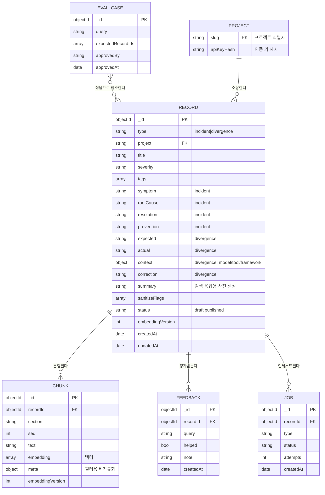
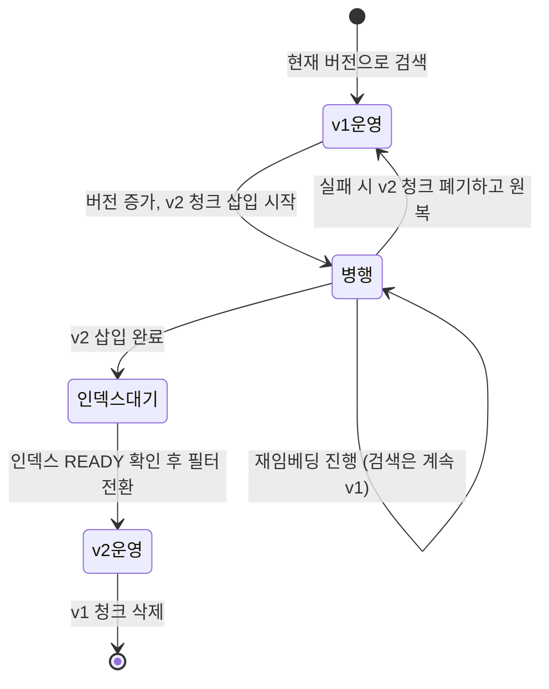

# 데이터베이스 설계서

## 1. 논리 데이터 모델

## 2. 데이터 사전 (주요 필드)

| 컬렉션 | 필드 | 타입 | 필수 | 제약 | 설명 |
|---|---|---|---|---|---|
| records | type | string | Y | incident\|divergence | 레코드 분류. 스키마 분기 기준 |
| records | project | string | Y | 인증 키에서 주입 | 쓰기 권한 경계 |
| records | title | string | Y | 4~200자 | 검색 결과 표시 |
| records | severity | string | N | SEV1~3, NOTE | 기본값 NOTE |
| records | symptom | string | 조건부 | 10자 이상 | incident 필수. 에러 원문 포함 권장 |
| records | resolution | string | 조건부 | 10자 이상 | incident 필수 |
| records | expected/actual | string | 조건부 | 10자 이상 | divergence 필수 |
| records | context | object | 조건부 | model/tool/framework | divergence의 재현 조건 |
| records | correction | string | 조건부 | 10자 이상 | divergence 필수. 환류 지식의 핵심 |
| records | summary | string | Y | 시스템 생성 | 검색 응답 본문 대체 |
| records | sanitizeFlags | array | Y | secret-masked, injection-suspect | 기본값 빈 배열 |
| chunks | section | string | Y | 8종 열거 | 섹션 필터의 기준 |
| chunks | embedding | array[double] | Y | 차원=설정값 | 벡터 인덱스 대상 |
| chunks | meta | object | Y | type/project/severity/tags/flags | 필터 성능용 비정규화 |
| jobs | status | string | Y | pending/running/failed/dead/done | 원자적 클레임 대상 |
| eval_cases | approvedBy | string | Y | "human" 고정 | 미승인 케이스는 eval에서 제외 |

## 3. 인덱스 설계
| 컬렉션 | 인덱스 | 유형 | 목적 |
|---|---|---|---|
| chunks | vec_idx (embedding) | Vector, cosine | 의미 검색. filter: meta.type, meta.project, embeddingVersion |
| chunks | text_idx (text) | Atlas Search | 에러코드·고유명사 검색 |
| chunks | recordId+section+seq+embeddingVersion | Unique | 인제스트 멱등성 보장 |
| records | project+type+createdAt | Compound | 목록 조회 |
| records | tags | Multikey | 태그 필터 |
| jobs | status+createdAt | Compound | 워커 폴링 |

**필터로 사용할 필드는 벡터 인덱스에 filter로 선언해야 한다.** 누락 시 쿼리가 실패한다.

## 4. 비정규화 근거
`chunks.meta`는 `records`의 필드를 복제한다. 벡터 검색은 파이프라인 첫 스테이지여야 하므로 조인 후 필터가 불가능하다. 복제 비용보다 필터 성능이 크다고 판단했다. 레코드 수정 시 청크 재생성으로 정합성을 유지한다.

## 5. 마이그레이션 전략 (NFR-06)

인플레이스 갱신을 금지하는 이유는 중간 상태에서 검색이 부분적으로 깨지기 때문이다. 롤백 경로가 항상 존재해야 한다.

## 6. 보존·백업
- 자동 백업 + 주간 덤프를 외부 스토리지로 이관, 30일 보존
- 레코드 삭제는 soft delete 미도입(현 범위). 필요 시 status 확장으로 대응
