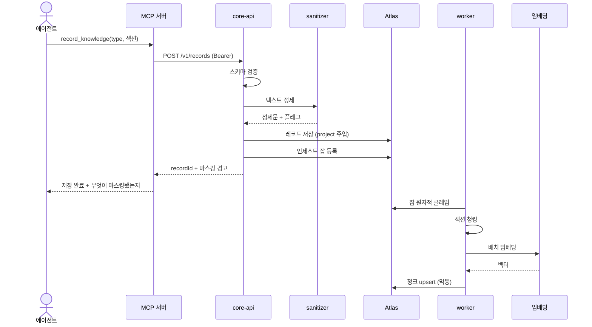
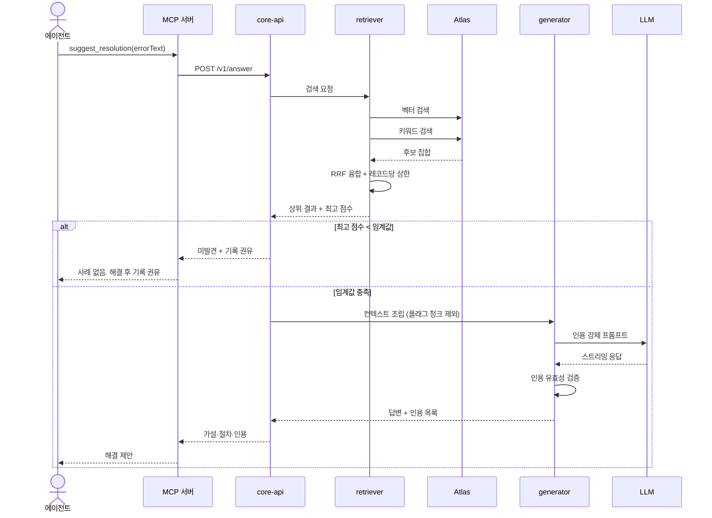
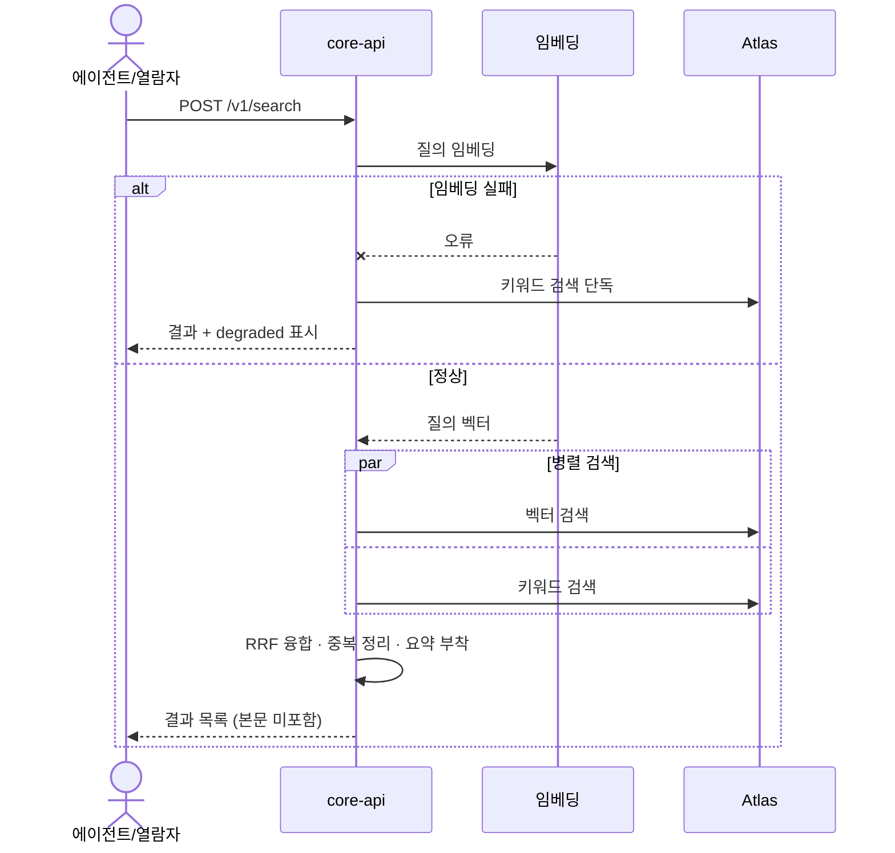

# 인터페이스 설계서

## 1. 인터페이스 목록
| ID | 인터페이스 | 프로토콜 | 소비자 |
|---|---|---|---|
| IF-01 | HTTP API | REST/JSON, SSE | 웹 UI, MCP 서버 |
| IF-02 | MCP 서버 | MCP over Streamable HTTP | 외부 AI 에이전트 |
| IF-03 | 임베딩 서비스 | HTTPS | core |
| IF-04 | LLM 서비스 | HTTPS(스트리밍) | core |
| IF-05 | 데이터 저장소 | MongoDB Wire | core, worker |

## 2. HTTP API (IF-01)

### 2.1 레코드
| Method | Path | 요청 | 응답 | 오류 |
|---|---|---|---|---|
| POST | /v1/records | CreateRecordInput | {recordId, sanitizeFlags, warning?} | 400 VALIDATION_FAILED, 401 |
| GET | /v1/records/:id | — | Record 전문 | 404 RECORD_NOT_FOUND |
| PATCH | /v1/records/:id | 부분 필드 | Record | 400, 404, 409 VERSION_CONFLICT |
| GET | /v1/records | project, type, tags, cursor | {items[], nextCursor} | 400 |

### 2.2 검색·생성
| Method | Path | 요청 | 응답 |
|---|---|---|---|
| POST | /v1/search | {query, type?, project?, limit} | {results: SearchHit[], degraded?} |
| POST | /v1/answer | {query, project?, stream?} | {found, answer?, citations[], suggestRecord?} |

`/v1/answer`의 스트리밍은 SSE로 `delta` → `citations` → `done` 순서의 이벤트를 보낸다.

### 2.3 피드백·상태
| Method | Path | 비고 |
|---|---|---|
| POST | /v1/feedback | 골든셋 후보로만 적재 |
| GET | /health | 인증 불요. mongo 상태·임베딩 버전 포함 |

### 2.4 공통 규약
- 인증: `Authorization: Bearer <key>`
- 오류 형식: `{error: {code, message, details?}}`
- 페이지네이션: cursor 방식. offset 미사용
- 레이트리밋: 키당 분당 60회

## 3. MCP 인터페이스 (IF-02)

### 3.1 도구 명세
| 도구 | 입력 | 출력 | 대응 UC |
|---|---|---|---|
| search_knowledge | query, type?, project?, limit? | 요약 목록(본문 미포함) | UC-01 |
| get_record | recordId | 전문(데이터 래핑) | UC-05 |
| record_knowledge | type, title, 섹션 필드 | recordId, 마스킹 경고 | UC-03, 04 |
| suggest_resolution | errorText, project? | 가설·절차·인용 또는 미발견 | UC-02 |
| give_feedback | recordId, helped, note? | 접수 확인 | UC-06 |

### 3.2 응답 규약
- 검색 응답은 토큰 예산을 지킨다. 전문은 별도 호출로 유도한다.
- 외부 콘텐츠는 데이터 블록으로 감싸고 지시 무시를 고지한다.
- 마스킹 발생 시 침묵하지 않고 응답에 포함한다.
- 도구 설명에는 **무엇을·언제·다른 도구와의 경계**를 모두 기술한다. 설명 변경은 계약 변경으로 취급한다.

## 4. 주요 시퀀스

### 4.1 기록 및 인제스트 (UC-03)

### 4.2 해결책 제안 (UC-02)

### 4.3 검색 (UC-01)

## 5. 외부 인터페이스 (IF-03/04)
- 임베딩: 배치 상한 32, 지수 백오프 3회. 인터페이스로 추상화하여 교체 가능
- LLM: 스트리밍 사용. 실패 시 검색 결과만 반환하는 우아한 저하
