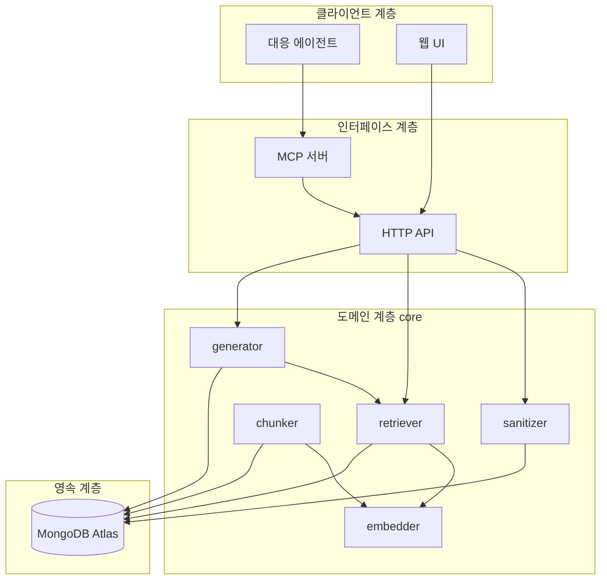

# 시스템 아키텍처 설계서 (SAD)
4+1 뷰 모델 기준.

## 1. 아키텍처 목표와 제약
| 목표 | 반영 |
|---|---|
| 에이전트가 1차 사용자 | MCP를 1차 인터페이스로, UI를 보조로 배치 |
| 여러 프로젝트에서 범용 사용 | 프로젝트 스코프를 인증 키에 내장, 읽기는 교차 허용 |
| 잘못된 답변보다 무응답이 낫다 | 유사도 임계값 게이트를 생성 앞단에 배치 |
| 소규모 운영 | 단일 인스턴스 + 상태 외부화 |

## 2. 논리 뷰 (Logical View)



**의존 규칙**: `web/mcp/api → core → contracts`. core는 HTTP·MCP를 알지 못한다. 역행 시 lint가 실패한다.

## 3. 프로세스 뷰 (Process View)
| 프로세스 | 역할 | 동시성 |
|---|---|---|
| core-api | 동기 요청 처리 | Node 단일 루프, 무상태 |
| mcp-server | 프로토콜 변환·정규화 | 세션별 컨텍스트, 무상태 |
| worker | 인제스트 비동기 처리 | 잡 단위 원자적 클레임, 수평 확장 가능 |

동기(검색·생성)와 비동기(임베딩)를 분리한 이유는, 임베딩 지연이 기록 행위를 막으면 기록률이 떨어지기 때문이다. **기록의 마찰을 0에 가깝게 유지하는 것이 이 시스템의 생존 조건이다.**

## 4. 개발 뷰 (Development View)

### 4.1 패키지
```
contracts → core → { api, worker } → { mcp, web }
```

### 4.2 인제스트 설계
레코드 저장과 인덱싱을 분리하고, 잡을 멱등으로 설계한다. 재시도 3회 후 dead 처리하되 레코드는 보존한다.

### 4.3 검색 설계
벡터 검색과 키워드 검색을 각각 수행 후 RRF로 융합한다. 가중합 대신 RRF를 택한 이유는 튜닝 파라미터를 줄여 회귀 가능성을 낮추기 위함이다. 레코드당 청크 상한을 두어 결과 다양성을 확보한다.

### 4.4 생성 설계
검색 → 임계값 판정 → 생성 → 인용 검증의 4단계다. 임계값 판정이 생성보다 **앞에** 있는 것이 핵심이다. 근거가 약할 때 모델을 부르지 않으면 환각이 구조적으로 불가능해진다.

### 4.5 새니타이즈 설계
저장 시점 1회, 응답 시점 1회의 이중 방어. 저장 시점은 자격증명 마스킹, 응답 시점은 데이터 래핑과 컨텍스트 제외다.

### 4.6 UI 설계
읽기 전용. 서버 컴포넌트에서 API를 호출해 키가 클라이언트로 나가지 않도록 한다.

## 5. 보안 설계
### 5.1 인증·인가
Bearer 키에 프로젝트 클레임을 내장한다. 읽기는 교차 프로젝트 허용(지식 공유가 목적), 쓰기는 자기 프로젝트로 강제한다.

### 5.2 간접 프롬프트 인젝션 방어
저장된 콘텐츠가 다른 프로젝트 에이전트의 컨텍스트로 들어가는 구조이므로, 저장소 자체가 공격 매개가 될 수 있다. 3중 방어를 둔다.
1. 저장 시 의심 패턴 탐지·표시
2. 응답 시 데이터 블록 래핑과 지시 무시 고지
3. 플래그된 청크를 생성 컨텍스트에서 제외

## 6. 성능 설계
- 검색 후보 수를 결과 수의 10~20배로 유지해 재현율 확보
- 요약을 저장 시점에 미리 생성해 검색 응답에서 본문 로드를 회피
- 스트리밍으로 첫 토큰 지연을 체감 단축

## 7. 물리 뷰 (Physical View) / 배포
단일 인스턴스에 컨테이너 5종을 배치하고 상태는 전부 외부 DB에 둔다. 인스턴스는 재생성 대상이지 복구 대상이 아니다.

## 8. 시나리오 뷰 (+1)
UC-01 검색, UC-02 제안, UC-03 기록, UC-08 마이그레이션 네 가지를 아키텍처 검증 시나리오로 삼는다. 상세 시퀀스는 INTERFACE-SPEC 참조.

## 9. 아키텍처 결정 기록 (ADR 요약)
| ID | 결정 | 대안 | 선택 이유 |
|---|---|---|---|
| ADR-01 | core를 독립 서비스로 분리 | Next.js Route Handler 통합 | UI 장애가 지식 접근을 막으면 안 됨 |
| ADR-02 | Atlas Vector Search | 전용 벡터 DB | 원문·벡터 정합성, 운영 단순성. 대규모에서는 열세 |
| ADR-03 | RRF 융합 | 가중합 | 튜닝 파라미터 최소화 |
| ADR-04 | Mongo 기반 잡 큐 | Redis/BullMQ | 현 규모에서 인프라 추가 비용이 이득을 초과 |
| ADR-05 | 임계값 게이트를 생성 앞단 | 후처리 필터 | 호출 자체를 막아야 환각이 구조적으로 차단됨 |
| ADR-06 | EC2 단일 + Compose | ECS/EKS | 운영 인원 1명 기준 과설계 회피 |
