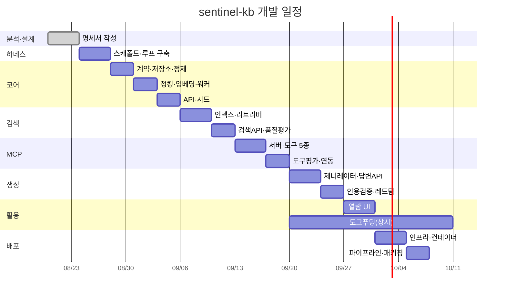

# 작업 분해 구조 (WBS) 및 일정

## 1. WBS
```
1. 분석·설계
   1.1 요구사항 명세 (SRS)
   1.2 유스케이스 명세
   1.3 아키텍처 설계 (SAD)
   1.4 데이터베이스 설계
   1.5 인터페이스 설계
   1.6 테스트 계획
   1.7 추적성 매트릭스
2. 개발 환경·하네스
   2.1 모노레포 스캐폴드            [T-001]
   2.2 에이전트 하네스 (규칙·스킬·서브에이전트)
   2.3 자동 구현 루프·계측          [T-000]
3. 코어 구현
   3.1 계약 스키마                  [T-002]
   3.2 저장소 부트스트랩            [T-003]
   3.3 새니타이저                   [T-004]
   3.4 청커                         [T-005]
   3.5 임베더                       [T-006]
   3.6 레코드 API                   [T-007]
   3.7 인제스트 워커                [T-008]
   3.8 시드 데이터                  [T-009]
4. 검색
   4.1 검색 인덱스                  [T-010]
   4.2 하이브리드 리트리버          [T-011]
   4.3 검색 API                     [T-012]
   4.4 검색 품질 평가               [T-013]
5. MCP
   5.1 서버·인증                    [T-014]
   5.2 도구 5종                     [T-015]
   5.3 도구선택 평가                [T-016]
   5.4 클라이언트 연동              [T-017]
6. 생성
   6.1 제너레이터·임계값            [T-018]
   6.2 답변 API·제안 도구           [T-019]
   6.3 인용 검증·생성 평가          [T-020]
   6.4 인젝션 레드팀                [T-021]
   6.5 피드백                       [T-022]
7. 활용·UI
   7.1 열람 UI                      [T-023]
   7.2 도그푸딩·수확 루프           [T-024]
8. 퍼블리싱 (M7 — 도그푸딩 데이터 축적 후)
   8.1 아티클 스키마·트리거          [T-029]
   8.2 팩트 추출기                   [T-030]
   8.3 작문 파이프라인·문체 린터     [T-031]
   8.4 다이어그램 생성·검증          [T-032]
   8.5 아티클 UI                     [T-033]
   8.6 스타일 평가                   [T-034]
9. 배포·마무리
   8.1 인프라 코드                  [T-025]
   8.2 컨테이너·리버스프록시        [T-026]
   8.3 배포 파이프라인              [T-027]
   8.4 산출물 패키징                [T-028]
```

## 2. 일정



## 3. 마일스톤 게이트
| M | 산출물 | 통과 조건 |
|---|---|---|
| M0 | 하네스 | 자동 루프로 더미 태스크 완결 |
| M1 | 코어 | 시드 50건 인제스트, 단위 테스트 통과 |
| M2 | 검색 | Recall@5 0.80 이상 |
| M3 | MCP | 원격 접속 성공, 도구선택 0.85 이상 |
| M4 | 생성 | 인용률 100%, 방어 10/10 |
| M5 | 활용 | 실사용 기록 30건, 적중 5건 |
| M6 | 배포 | 프로덕션 데모, 평가 리포트 |
| M7 | 퍼블리싱 | 실데이터 기반 발행 아티클 3편, 스타일 eval 리포트 |

게이트 미달 시 다음 마일스톤 진입을 금지한다. 품질 부채를 뒤로 미루면 평가 지표가 의미를 잃는다.

## 4. 자원 및 역할
1인 개발 + AI 에이전트 루프. 사람이 시간을 쓰는 지점은 네 곳으로 한정한다.
태스크 스펙 작성·승인, 계약 변경 판단, 병합 검토, 골든셋 승인.

## 5. 리스크 등록부
| ID | 리스크 | 확률 | 영향 | 대응 |
|---|---|---|---|---|
| R1 | 시드 품질 부족으로 평가가 무의미 | 중 | 상 | 고품질 40건 우선 확보, 골든셋 수기 검수 |
| R2 | 원격 MCP 노출로 인한 공격면 | 중 | 상 | 인증 필수, 단일 포트, 레이트리밋, 스코프 제한 |
| R3 | 저장 콘텐츠 경유 인젝션 | 중 | 상 | 3중 방어 + 레드팀 상시화 |
| R4 | 도그푸딩 중단으로 실사용 지표 미달 | 상 | 중 | 별도 마일스톤으로 고정, 프로토콜을 M3 완료 조건에 포함 |
| R5 | 자동 루프가 평가를 우회 | 중 | 상 | 평가·테스트 파일 수정을 별도 태스크로 격리, 검토 게이트 |
| R6 | 범위 확대 | 상 | 중 | P2 항목 착수 금지, 태스크마다 범위 외 명시 |
| R7 | 키 1개 유출 시 전체 지식 열람 (교차 읽기의 수용 리스크) | 저 | 상 | 키 회전 절차 문서화, 접근 감사 로그, 민감 프로젝트 격리 옵션(P2), 레이트리밋 |
